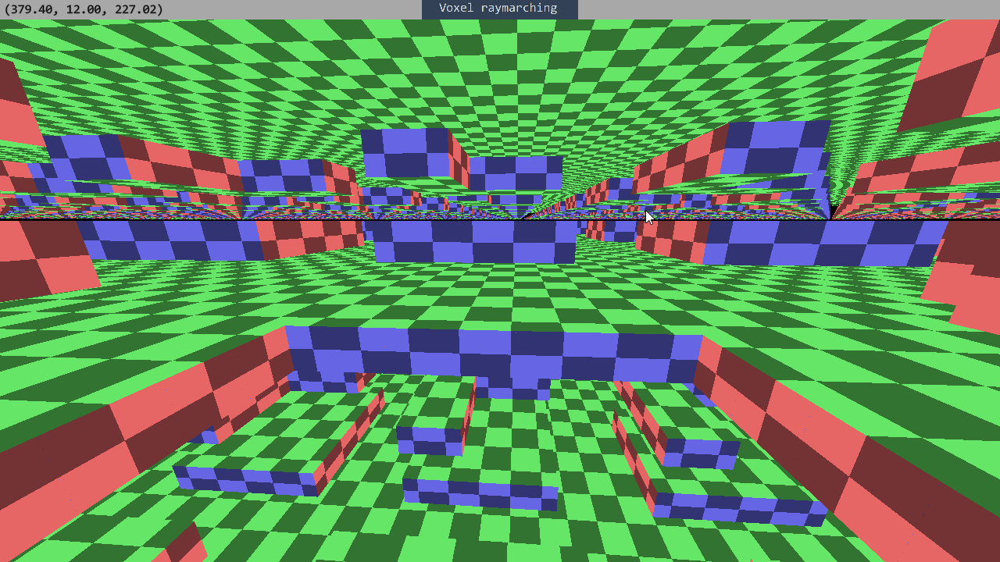
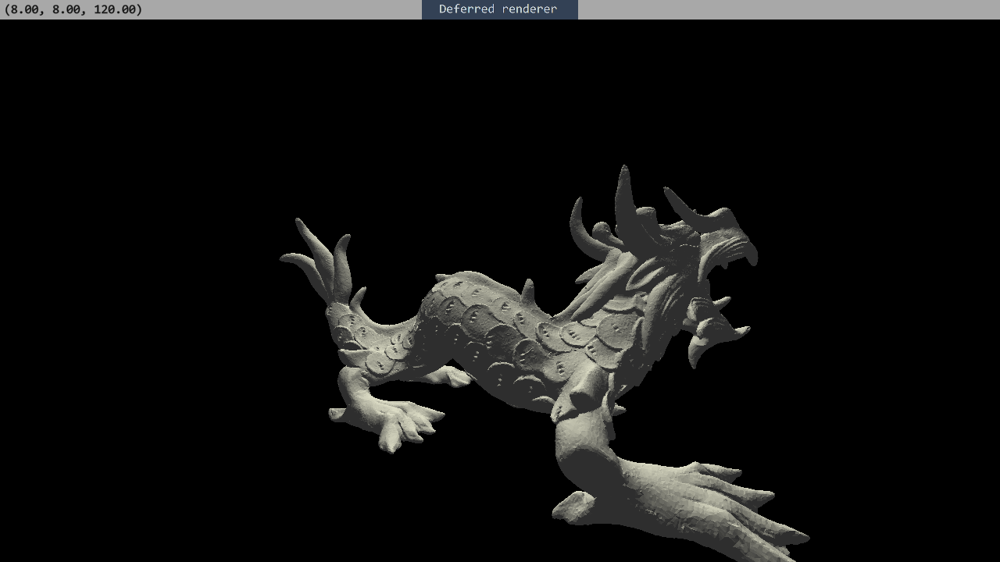
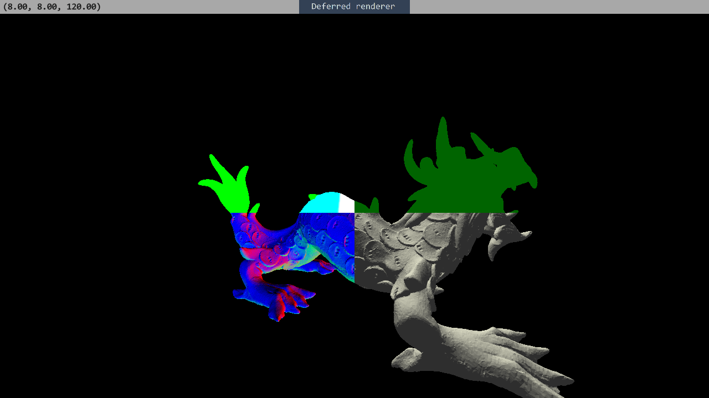

This is a toy project, that I used to learn basics of graphics programming and vulkan. \
Project is a mess, because as I was trying and learning new stuff, some parts were added, updated and replaced, while other were written once at the start of the journey and used without any change. \
Lots of stuff can be improved and fixed, features can be added, but before that some parts need to be rewritten from ground up.

Win64 binaries can be downloaded from [actions](https://github.com/pickar2/VulkanEngine/actions).
## Libraries and tools
* [.NET 7.0](https://dotnet.microsoft.com/en-us/download/dotnet/7.0) SDK
* [Silk.NET](https://github.com/dotnet/Silk.NET) as vulkan bindings.
* [SDL2-CS](https://github.com/Ryujinx/SDL2-CS) as SDL bindings.
* [SPIRV-Reflect](https://github.com/KhronosGroup/SPIRV-Reflect) to ease creation of vulkan pipelines by reading descriptors' inputs and outputs from compiled shaders.
* [shaderc](https://github.com/google/shaderc) to compile shaders at runtime.
* [VMA](https://github.com/GPUOpen-LibrariesAndSDKs/VulkanMemoryAllocator) to help with vulkan memory management.
* [Quite OK Image Format](https://qoiformat.org/) to avoid dealing with pngs.
* [sdf_atlas](https://github.com/astiopin/sdf_atlas) tool to generate sdf fonts.
* [RenderDoc](https://renderdoc.org/) to debug graphics.
## Technologies
SDL2 window.

Vulkan 1.2 renderer with primitive render graph.

Bindless ui system, everything is being drawn in one draw call.
Compute shaders are being used to build vertex/index buffers and to sort ui parts by their z index.
Different materials being read and compiled into one shader at runtime. 
Data used by different materials is being stored using arena allocator with free list.

SimpleMath library created using c# source generators.
## Screenshots
Fully functional shader graph system. Example shader [adapted from](https://www.shadertoy.com/view/mdBSRt)\

Ui is built using my own retained mode system.

[Parallax voxel raymarching](https://www.youtube.com/watch?v=h81I8hR56vQ)

Basic deferred shading pipeline

Debug view (positions/material/normals/shaded)

